# S-DES_2023

[TOC]


## 作业报告

### 第一关：基本测试

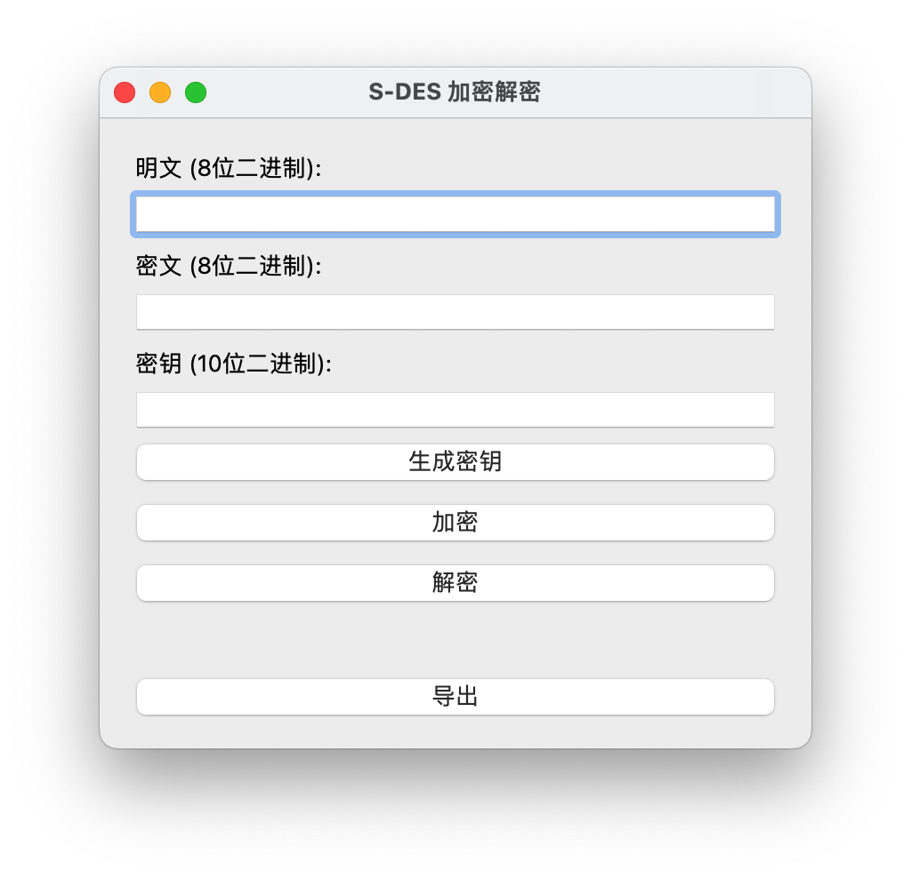

当输入的明文不符合要求的时候，会弹出报错提醒：

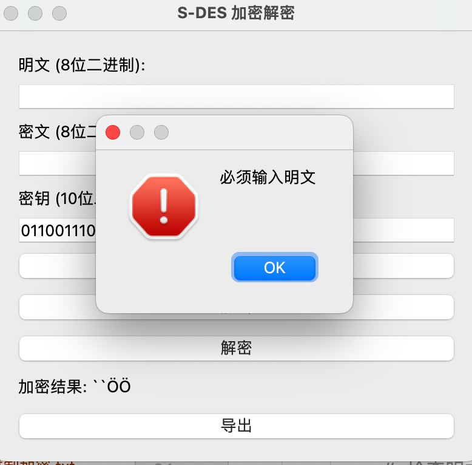

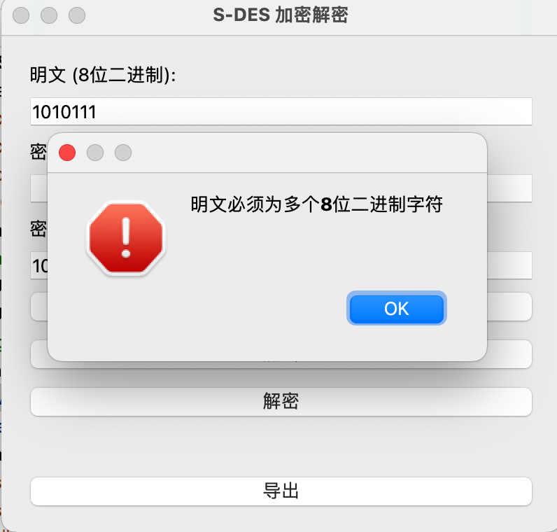

点击生成密钥可以随机生成一个10bits的密钥，点击导出可以将结果保存在txt文件中。

#### 加密测试

明文：10101111

密钥：0001011001

加密结果：00011101

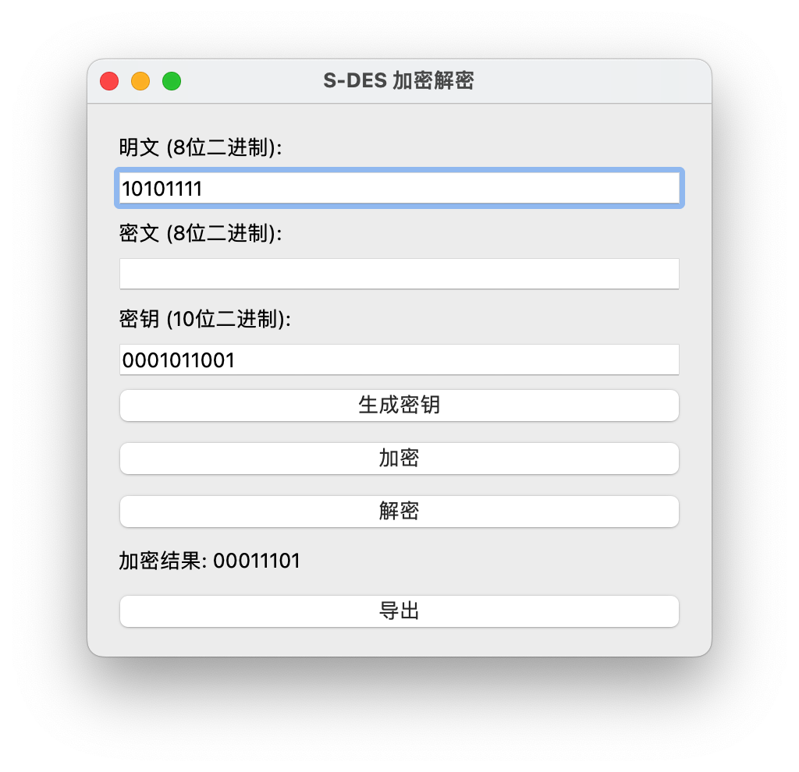

#### 解密测试

密文：00011101

密钥：0001011001

解密结果：10101111

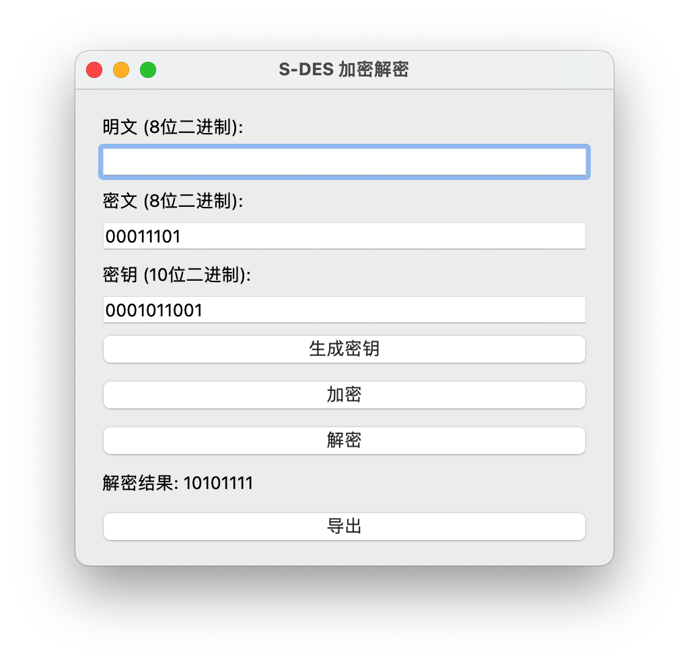

### 第二关：交叉测试

本地的S-DES加密记录，分别包括二进制加密和ASCII加密：


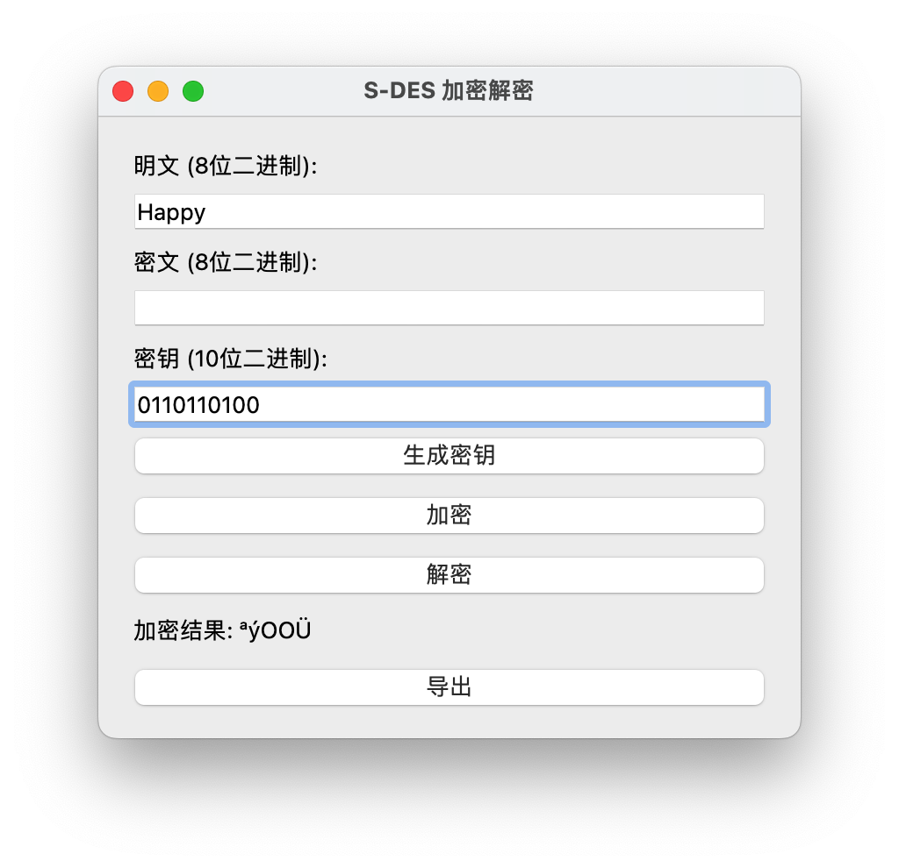

另一个验证组的解密结果如下：


### 第三关：拓展功能

我们的程序允许输入任意长度的ASCII码字符串，并给出对应的ASCII码字符串密文，同时也可以根据对应的密文和密钥进行解密。

对字符串“Hello”进行加密：

得到密文：&Xkk)

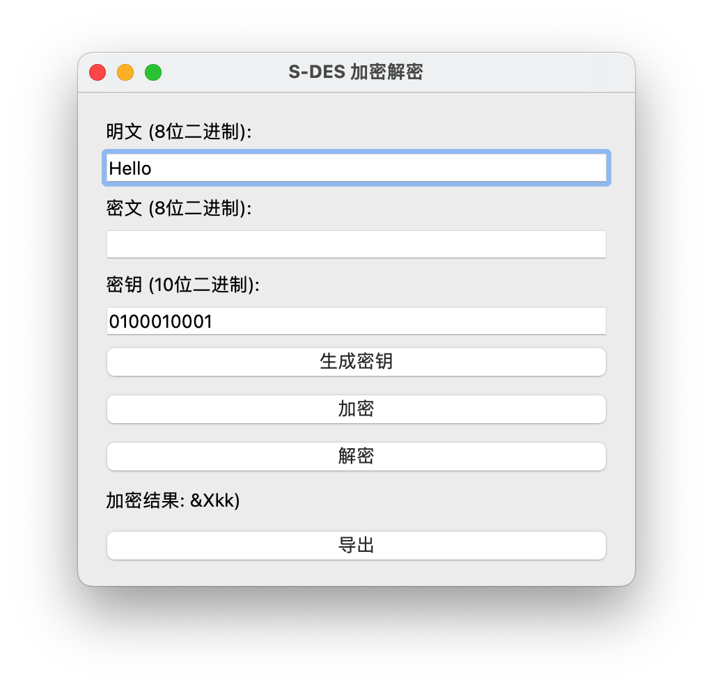

对上述密文进行解密，结果显示如下：

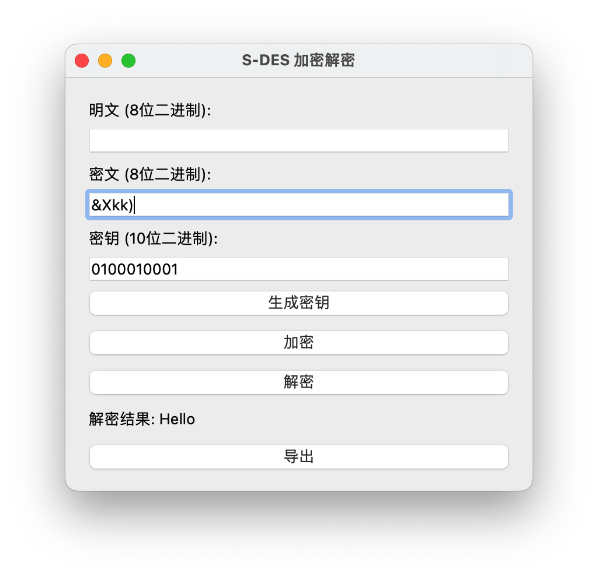

### 第四关：暴力破解

根据实验我们获取了以下三个明密文对：

| 明文 | 10101100 | 10101111 | 01010011 |
| ---- | -------- | -------- | -------- |
| 密文 | 11001101 | 11111011 | 11000001 |

运行相关的破解程序后，获得的结果如下：

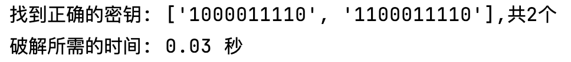

有两个密钥1000011110、1100011110均符合我们提供的明密文对。

### 第五关：封闭测试

根据第4关的结果进行分析，得到以下结论：

(1)   对于随机选择的一个明密文对，确实存在不止一个密钥Key。假设明文为*[1,1,0,0,0,0,1,0]*，密文为*[0,0,0,1,1,1,1,0]*，通过暴力破解找到4个密钥：*['1001011111', '1010000110', '1101011111', '1110000110']*，用时0.02秒。

(2)   进一步扩展，对于明文空间内任意给定的明文分组Pn，会出现选择不同的密钥Ki和Kj（Ki≠ Kj）加密得到相同密文Cn的情况。例设明文分组为*[ [1,0,1,1,1,0,0,1], [1,1,1,1,1,1,0,0], [0,1,1,0,1,0,1,0] ]*，密文分组为*[ [0,1,0,1,1,0,0,0], [1,0,1,0,1,0,1,0], [0,1,0,1,0,1,0,1] ]*， 通过暴力破解找到2个密钥：*['1000101010', '1100101010']*，用时0.03秒。


## 用户指南

### S-DES 加密解密工具

S-DES（Simplified Data Encryption Standard）是一种用于数据加密的简化版本的DES算法。这个工具提供了一个图形用户界面，用于加密和解密文本数据。以下是如何使用这个工具的步骤。

#### 步骤 1: 启动工具

运行应用程序，它会打开S-DES加密解密工具的用户界面。

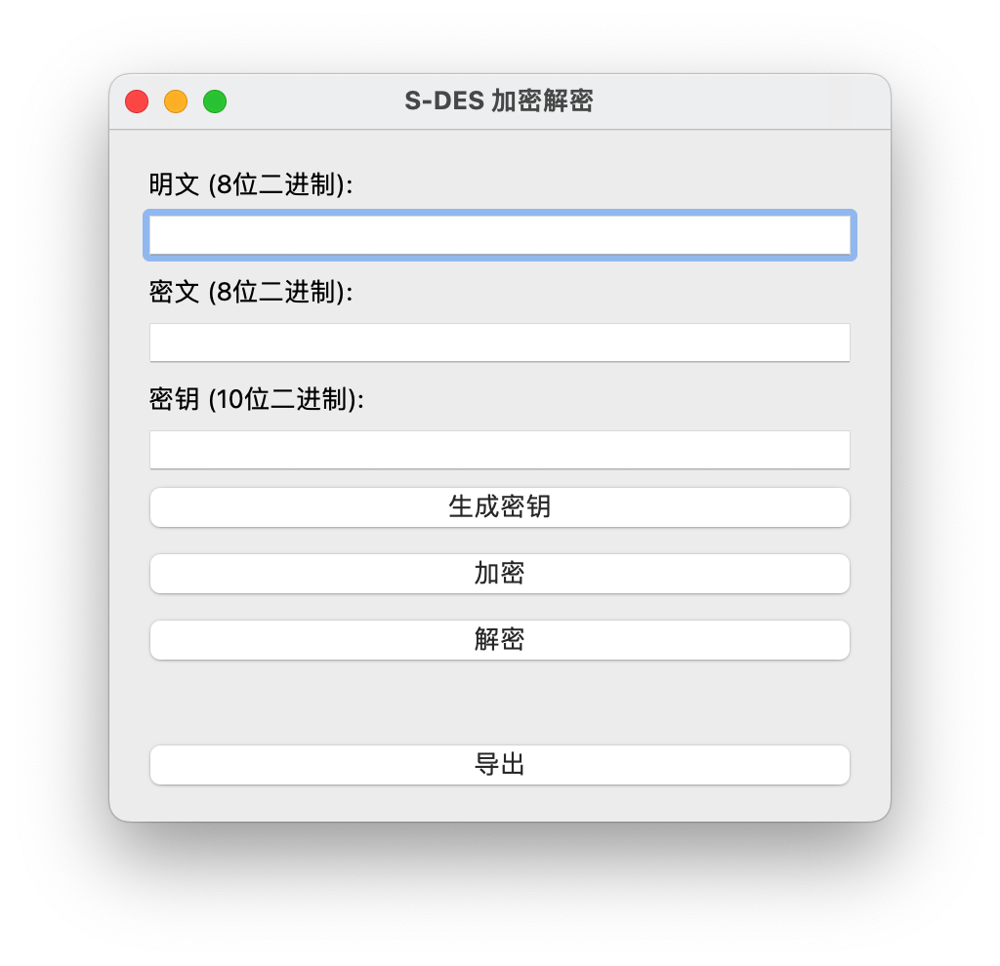

#### 步骤 2: 输入明文

在 "明文 (8位二进制):" 文本框中输入要加密的文本。确保输入的文本是8位的二进制数据或者是任意的ASCII码字符串。

#### 步骤 3: 输入密钥

在 "密钥 (10位二进制):" 文本框中输入加密所需的密钥。密钥必须是10位的二进制数据。

#### 步骤 4: 生成密钥（可选）

点击 "生成密钥" 按钮，系统将自动生成一个随机的10位二进制密钥，并在 "密钥" 文本框中显示。也可以根据自己的需求输入一个10位二进制密钥。

#### 步骤 5: 加密或解密

点击 "加密" 按钮，系统将使用输入的明文和密钥执行加密操作。加密结果将显示在导出按钮上方。

如果您有一个已知的密文和相应的密钥，您可以在 "密文 (8位二进制):" 文本框中输入密文，以及对应的密钥，然后点击 "解密" 按钮来解密数据。解密结果将显示在导出按钮上方。

#### 步骤 6: 导出结果

如果需要，您可以点击 "导出" 按钮将加密或解密的结果保存到文件中。

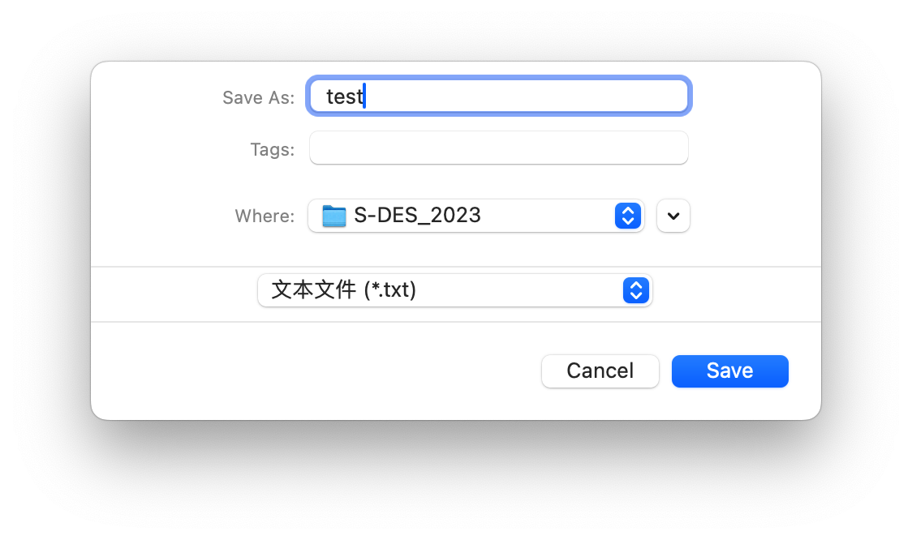

## 开发手册

### SDES 类

SDES 类实现了S-DES算法的核心功能。

1. `__init__()`

类的初始化函数，用于初始化SDES对象。

源代码：

```python
def __init__(self):
    # 初始化置换表、S盒等参数
    self.IP = [2, 6, 3, 1, 4, 8, 5, 7]
    self.IP_INV = [4, 1, 3, 5, 7, 2, 8, 6]
    self.EP = [4, 1, 2, 3, 2, 3, 4, 1]
    self.P4 = [2, 4, 3, 1]
    self.P8 = [6, 3, 7, 4, 8, 5, 10, 9]
    self.P10 = [3, 5, 2, 7, 4, 10, 1, 9, 8, 6]
    self.S0 = [[1, 0, 3, 2], [3, 2, 1, 0], [0, 2, 1, 3], [3, 1, 0, 2]]
    self.S1 = [[0, 1, 2, 3], [2, 3, 1, 0], [3, 0, 1, 2], [2, 1, 0, 3]]
    self.SPBOX = [2, 4, 3, 1]
```

2. `generate_random_key()`

- 描述：生成一个随机的10位二进制密钥。

- 输入参数：无

- 返回值：长度为10的二进制密钥列表。

  ```python
  def generate_random_key(self):
    # 生成一个长度为10的随机二进制密钥
    key = [random.randint(0, 1) for _ in range(10)]
    return key
  ```

3. `Key_Generate(key)`

- 描述：生成子密钥K1和K2。

- 输入参数：

  - `key`：长度为10的二进制密钥列表。

- 返回值：包含K1和K2的元组，每个子密钥都是长度为8的二进制列表。

  ```python
  def Key_Generate(self, key):
    # P10置换
    p10_key = []
    for i in range(10):
    p10_key.append(key[self.P10[i] - 1])
    print("p10_key")
    print(p10_key)
    # 循环左移
    left_key = p10_key[:5]
    right_key = p10_key[5:]
    left_key = left_key[1:] + left_key[:1]
    right_key = right_key[1:] + right_key[:1]
    q_key = left_key + right_key
    # P8置换
    p8_key = [0] * 8
    for i in range(8):
    p8_key[i] = q_key[self.P8[i] - 1]
    # 子密钥K1和K2生成
    # 循环左移1位得到K1
    k1 = p8_key
    # 循环左移2位得到K2
    left_key1 = left_key[1:] + left_key[:1]
    right_key1 = right_key[1:] + right_key[:1]
    q_key1 = left_key1 + right_key1
    # P8置换
    p8_key1 = [0] * 8
    for i in range(8):
    p8_key1[i] = q_key1[self.P8[i] - 1]
    k2 = p8_key1
    return k1, k2
  ```

4. `expandFunction(data)`

- 描述：执行EP扩展操作。

- **输入参数**：
  - `data`：长度为8的二进制数据列表。

- **返回值**：长度为8的二进制数据列表。

- **源代码**：

```python
def expandFunction(self, data):
    expand_data = []
    for i in range(8):
        expand_data.append(data[self.EP[i]-1])
    return expand_data
```

5. `xorCalculation(data1, data2)`

- 描述：执行二进制数据的异或运算。

- **输入参数**：
  - `data1`：长度相等的二进制数据列表。
  - `data2`：长度相等的二进制数据列表。

- **返回值**：长度相等的二进制数据列表，结果为data1与data2逐位异或的结果。

- **源代码**：

```python
def xorCalculation(self, data1, data2):
    result = []
    for i in range(len(data1)):
        result.append(data1[i] ^ data2[i])
    return result
```

6. `SBox(data)`

- 描述：执行S盒运算。

- **输入参数**：
  - `data`：长度为4的二进制数据列表，用于S盒查找。

- **返回值**：长度为4的二进制数据列表，经过S盒查找后的结果。

- **源代码**：

```python
def SBox(self, data):
    left = data[0:4]
    right = data[4:8]
    row = left[0] * 2 + left[3]
    col = left[1] * 2 + left[2]
    s0 = self.S0[row][col]
    row = right[0] * 2 + right[3]
    col = right[1] * 2 + right[2]
    s1 = self.S1[row][col]
    result = []
    result.append(s0 // 2)
    result.append(s0 % 2)
    result.append(s1 // 2)
    result.append(s1 % 2)
    return result
```

7. `P4Function(data)`

- 描述：执行P4直接置换。

- **输入参数**：
  - `data`：长度为4的二进制数据列表。

- **返回值**：长度为4的二进制

数据列表，经过P4置换后的结果。

- **源代码**：

```python
def P4Function(self, data):
    result = []
    for i in range(4):
        result.append(data[self.P4[i]-1])
    return result
```

8. `FFunction(data, key)`

- 描述：SDES的F函数，包括EP扩展、S盒查找和P4置换。

- **输入参数**：
  - `data`：长度为4的二进制数据列表，输入数据。
  - `key`：长度为8的二进制数据列表，子密钥K。

- **返回值**：长度为4的二进制数据列表，F函数的输出结果。

- **源代码**：

```python
def fFunction(self, data, key):
    # 执行EP扩展
    expanded_data = self.expandFunction(data)
    # 与子密钥异或
    xored_data = self.xorCalculation(expanded_data, key)
    # 执行S盒查找
    sbox_result = self.SBox(xored_data)
    # 执行P4置换
    p4_result = self.P4Function(sbox_result)
    return p4_result
```

9. `encrypt(data, key)`

- 描述：使用给定的密钥对数据进行加密。

- **输入参数**：
  - `data`：长度为8的二进制明文数据列表。
  - `key`：长度为10的二进制密钥列表。

- **返回值**：长度为8的二进制密文数据列表。

- **源代码**：

```python
def encrypt(self, data, key):
    # 初始置换IP
    ip_data = []
    for i in range(8):
        ip_data.append(data[self.IP[i]-1])
    # 生成子密钥K1和K2
    k1, k2 = self.Key_Generate(key)
    # 初始轮
    round1 = self.FKFunction(ip_data, k1)
    # 交换左右半部分
    swaped_data = self.swap(round1)
    # 第二轮
    round2 = self.FKFunction(swaped_data, k2)
    # 逆初始置换IP^-1
    ip_inv_data = []
    for i in range(8):
        ip_inv_data.append(round2[self.IP_INV[i]-1])
    return ip_inv_data
```

10. `decrypt(data, key)`

- 描述：使用给定的密钥对数据进行解密。

- **输入参数**：
  - `data`：长度为8的二进制密文数据列表。
  - `key`：长度为10的二进制密钥列表。

- **返回值**：长度为8的二进制明文数据列表。

- **源代码**：

```python
def decrypt(self, data, key):
    # 初始置换IP
    ip_data = []
    for i in range(8):
        ip_data.append(data[self.IP[i]-1])
    # 生成子密钥K1和K2
    k1, k2 = self.Key_Generate(key)
    # 初始轮
    round1 = self.FKFunction(ip_data, k2)
    # 交换左右半部分
    swaped_data = self.swap(round1)
    # 第二轮
    round2 = self.FKFunction(swaped_data, k1)
    # 逆初始置换IP^-1
    ip_inv_data = []
    for i in range(8):
        ip_inv_data.append(round2[self.IP_INV[i]-1])
    return ip_inv_data
```

### GUI设计

以下是GUI设计的开发手册，包括每个方法的说明和源代码：

1. `__init__()`

- **描述**：类的初始化函数，用于初始化SDESApp对象。

- **源代码**：

```python
def __init__(self):
    super().__init__()
    ASCII= False
    self.initUI()
```

2. `initUI()`

- **描述**：用于创建GUI界面的初始化函数。

- **源代码**：

```python
def initUI(self):
    self.setWindowTitle('S-DES 加密解密')
    self.setGeometry(100, 100, 400, 200)

    layout = QVBoxLayout()

    # 明文输入框
    self.plain_text_label = QLabel('明文 (8位二进制):')
    self.plain_text_input = QLineEdit()
    layout.addWidget(self.plain_text_label)
    layout.addWidget(self.plain_text_input)

    # 密文输入框
    self.cipher_text_label = QLabel('密文 (8位二进制):')
    self.cipher_text_input = QLineEdit()
    layout.addWidget(self.cipher_text_label)
    layout.addWidget(self.cipher_text_input)

    # 密钥输入框
    self.key_label = QLabel('密钥 (10位二进制):')
    self.key_input = QLineEdit()
    layout.addWidget(self.key_label)
    layout.addWidget(self.key_input)

    # 生成密钥按钮
    self.generate_key_button = QPushButton('生成密钥')
    self.generate_key_button.clicked.connect(self.generate_key)
    layout.addWidget(self.generate_key_button)

    # 加密按钮
    self.encrypt_button = QPushButton('加密')
    self.encrypt_button.clicked.connect(self.encrypt)
    layout.addWidget(self.encrypt_button)

    # 解密按钮
    self.decrypt_button = QPushButton('解密')
    self.decrypt_button.clicked.connect(self.decrypt)
    layout.addWidget(self.decrypt_button)

    # 结果显示
    self.result_label = QLabel('')
    layout.addWidget(self.result_label)
    self.setLayout(layout)

    # 导出按钮
    self.export_button = QPushButton('导出')
    self.export_button.clicked.connect(self.export_data)
    layout.addWidget(self.export_button)
```

3. `generate_key()`

- **描述**：用于生成随机的10位二进制密钥。

- **源代码**：

```python
def generate_key(self):
    # 调用SDES类的生成密钥方法
    sdes = SDES()
    key = sdes.generate_random_key()
    # 显示生成的密钥
    self.key_input.setText(''.join(map(str, key)))
```

4. `ascii_to_binary(character)`

- **描述**：将字符的ASCII值转换为8位二进制字符串。

- **输入参数**：
  - `character`：需要转换的ASCII字符。

- **返回值**：8位二进制字符串。

- **源代码**：

```python
def ascii_to_binary(self, character):
    # 使用format函数将字符的ASCII值转换为8位二进制字符串
    binary_representation = format(ord(character), '08b')
    return binary_representation
```

5. `encrypt()`

- **描述**：执行加密操作，将明文或ASCII字符转换为SDES加密结果。

- **源代码**：

```python
def encrypt(self):
    plaintext = self.plain_text_input.text()
    key = self.key_input.text()
    self.ASCII = False  # 设置为False

    # 检查是否为空
    if len(plaintext) == 0:
        QMessageBox.critical(self, '错误', '必须输入明文')
        return

    # 检查明文是否全为0或1
    for i in range(len(plaintext)):
        if plaintext[i] != '0' and plaintext[i] != '1':
            self.ASCII = True
            break
    plaintextlist = []
    if self.ASCII:
        print("ASCII加密")
        # 尝试将明文转换为ASCII编码
        print(plaintext)
        for char in plaintext:
            binary_representation = self.ascii_to_binary(char)
            print(binary_representation)
            plaintextlist.append(binary_representation)
    else:
        print("二进制加密")
        # 检查明文是否为8位
        if len(plaintext) % 8 != 0:
            QMessageBox.critical(self, '错误', '明文必须为多个8位二进制字符')
            return
        for i in range(0, len(plaintext), 8):
            plaintextlist.append(plaintext[i:i + 8])
    sdes = SDES()
    ciphertextlist = []
    for i in range(len(plaintextlist)):
        ciphertext = sdes.encrypt([int(bit) for bit in plaintextlist[i]], [int(bit) for bit in key])
        # 显示加密结果
        print(ciphertext)
        if self.ASCII:
            # ASCII加密展示，将二进制字符串转换为ASCII字符
            # ciphertextlist.append(ciphertext)
            binary_string = ''.join(map(str, ciphertext))
            # 将二进制字符串转换为整数
            ascii_code = int(binary_string, 2)
            print(ascii_code)
            # 将整数转换为字符
            if ascii_code > 127:
                utf8_character = chr(ascii_code).encode('utf-8')
                ciphertextlist.append(utf8_character.decode('utf-8'))
                print(utf8_character.decode('utf-8'))
            else:
                # 否则将整数转换为ASCII字符
                ciphertextlist.append(chr(ascii_code))
                print(chr(ascii_code))

            encrypted_text = "".join(["".join(map(str, cipher)) for cipher in ciphertextlist])
            self.result_label.setText(f'加密结果: {encrypted_text}')
        else:
            # 二进制加密展示
            ciphertextlist.append(ciphertext)
            encrypted_text = " ".join(["".join(map(str, cipher)) for cipher in ciphertextlist])
            self.result_label.setText(f'加密结果: {encrypted_text}')

```

6. `decrypt()`

- **描述**：执行解密操作，将密文或ASCII字符转换为SDES解密结果。

- **源代码**：

```python
def decrypt(self):
    ciphertext = self.cipher_text_input.text()
    key = self.key_input.text()
    self.ASCII = False  # 设置为False

    # 检查是否为空
    if len(ciphertext) == 0:
        QMessageBox.critical(self, '错误', '必须输入密文')
        return
    # 检查密文是否全为0或1
    for i in range(len(ciphertext)):
        if ciphertext[i] != '0' and ciphertext[i] != '1':
            self.ASCII = True
            break
    ciphertextlist = []
    if self.ASCII:
        print("ASCII解密")
        # ASCII解密展示，将ASCII字符转换为二进制字符串
        for char in ciphertext:
            ascii_code = ord(char)
            binary_representation = bin(ascii_code)[2:].zfill(8)
            ciphertextlist.append([int(bit) for bit in binary_representation])
    else:
        print("二进制解密")
        # 检查密文是否为8位
        if len(ciphertext) % 8 != 0:
            QMessageBox.critical(self, '错误', '密文必须为多个8位二进制字符')
            return
        for i in range(0, len(ciphertext), 8):
            ciphertextlist.append([int(bit) for bit in ciphertext[i:i + 8]])

    sdes = SDES()
    plaintextlist = []
    for i in range(len(ciphertextlist)):
        plaintext = sdes.decrypt(ciphertextlist[i], [int(bit) for bit in key])
        # 显示解密结果
        print(plaintext)
        if self.ASCII:
            # ASCII解密展示，将二进制字符串转换为ASCII字符
            binary_string = ''.join(map(str, plaintext))
            # 将二进制字符串转换为整数
            ascii_code = int(binary_string, 2)
            # 将整数转换为字符
            if ascii_code > 127:
                utf8_character = chr(ascii_code).encode('utf-8')
                plaintextlist.append(utf8_character.decode('utf-8'))
            else:
                # 否则将整数转换为ASCII字符
                plaintextlist.append(chr(ascii_code))
        else:
            # 二进制解密展示
            plaintextlist.append("".join(map(str, plaintext)))

    decrypted_text = "".join(plaintextlist)
    self.result_label.setText(f'解密结果: {decrypted_text}')

```

7. `export_data()`

- **描述**：将明文、密钥和加密结果导出到文件。

- **源代码**：

```python
def export_data(self):
    plaintext = self.plain_text_input.text()
    key = self.key_input.text()
    result = self.result_label.text()

    # 使用文件对话框选择保存文件路径
    options = QFileDialog.Options()
    options |= QFileDialog.ReadOnly
    file_name, _ = QFileDialog.getSaveFileName(self, "保存信息", "", "文本文件 (*.txt);;所有文件 (*)",options=options)

    if file_name:
      # 将明文和密钥保存到文件中
      with open(file_name, 'w') as file:
        file.write(f"明文: {plaintext}\n")
        file.write(f"密钥: {key}")
        file.write(f"加密结果: {result}")
        QMessageBox.information(self, '信息', '结果已成功导出到文件。')

```

### 破解部分

1. `brute_force_decrypt(ciphertext, known_plaintexts, max_key_attempts=1024)`

- **描述**：执行SDES密钥破解的函数，尝试不同的密钥来解密给定的密文，以找到正确的密钥。

- **输入参数**：
  - `ciphertext`：包含密文的列表，每个密文是长度为8的二进制列表。
  - `known_plaintexts`：包含已知明文的列表，每个明文是长度为8的二进制列表。
  - `max_key_attempts`：（可选）尝试的最大密钥数量，默认为1024。

- **返回值**：一个包含正确密钥的列表和破解所需的时间。

- **源代码示例**：

```python
def brute_force_decrypt(ciphertext, known_plaintexts, max_key_attempts=1024):
    sdes = SDES()
    start_time = time.time()  # 记录开始时间

    key_list = []
    for key in range(0, max_key_attempts):
        key_binary = bin(key)[2:].zfill(10)  # 将整数密钥转换为10位二进制表示
        flag = 0
        for i in range(len(known_plaintexts)):
            decrypted = sdes.decrypt(ciphertext[i], [int(bit) for bit in key_binary])
            
            # 如果解密结果与已知的明文不匹配，表示这个密钥不正确
            if decrypted != known_plaintexts[i]:
                break
            else:
                flag += 1
        # 如果对于所有明文密文对都匹配，表示找到了正确的密钥
        if flag == len(known_plaintexts):
            key_list.append(key_binary)

    # 如果找到了一个或多个密钥
    if key_list:
        end_time = time.time()  # 记录结束时间
        elapsed_time = end_time - start_time
        return key_list, elapsed_time
    else:
        # 如果遍历所有可能的密钥都没有匹配，返回 None 表示失败
        return None, None
```

2. `if __name__ == "__main__":`

- **描述**：检查是否作为主程序运行，如果是，则执行密钥破解。

- **源代码示例**：

```python
if __name__ == "__main__":
    known_plaintexts = [
        [1,0,1,0,1,1,0,0],
        [1,0,1,0,1,1,1,1],
        [0,1,0,1,0,0,1,1],
    ]
    ciphertexts = [
        [1,1,0,0,1,1,0,1],
        [1,1,1,1,1,0,1,1],
        [1,1,0,0,0,0,0,1],
    ]
    found_key, elapsed_time = brute_force_decrypt(ciphertexts, known_plaintexts)
    if found_key:
        print(f"找到正确的密钥: {found_key},共{len(found_key)}个")
        print(f"破解所需的时间: {elapsed_time:.2f} 秒")
    else:
        print("未找到正确的密钥")
```

